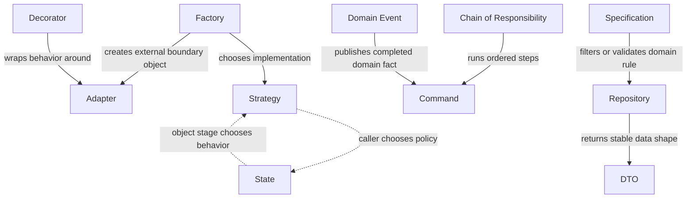

# Pattern Index

This index is a navigation layer for the current repository state. It focuses on the patterns and guides that already exist today.

## How To Use This Index

- Start with the decision guides if you know the problem but not the pattern name.
- Use the core pattern list when you already have a candidate abstraction.
- Use the scenario list when you want to see multiple patterns working together.
- Use [Testing With Patterns](./01-decision-guides/testing-with-patterns.md) when you need test-double guidance; it is intentionally documentation-first.
- Treat items without runnable coverage as documentation-first guidance, not as missing placeholders.

How the core patterns relate to each other:

## Decision Guides

| Guide | Focus |
|---|---|
| [Choose by Problem](./01-decision-guides/choose-by-problem.md) | Start from a recurring problem such as provider switching or long workflow logic. |
| [Choose by Project Layer](./01-decision-guides/choose-by-project-layer.md) | Decide which patterns make sense in presentation, application, domain, infrastructure, or testing. |
| [Choose by Code Smell](./01-decision-guides/choose-by-code-smell.md) | Move from concrete code smells to candidate patterns or simpler fixes. |
| [Pattern vs Pattern](./01-decision-guides/pattern-vs-pattern.md) | Compare similar or commonly confused patterns. |
| [Testing With Patterns](./01-decision-guides/testing-with-patterns.md) | Decide when to use mocks, fakes, real collaborators, and contract tests around pattern boundaries. This guide is intentionally docs-only. |

## Core Pattern Guides

The full canonical GoF catalog is covered below, plus this repository's simple-factory guide.

### Creational

| Pattern | Primary Use |
|---|---|
| [Factory](./02-gof-patterns/creational/factory.md) | Hide object creation choices behind a stable entry point. |
| [Factory Method](./02-gof-patterns/creational/factory-method.md) | Let a base workflow delegate which concrete class to create to an overridable hook. |
| [Abstract Factory](./02-gof-patterns/creational/abstract-factory.md) | Create matched families of collaborators through one interface so variants stay consistent. |
| [Builder](./02-gof-patterns/creational/builder.md) | Construct complex objects step by step without telescoping constructors. |
| [Prototype](./02-gof-patterns/creational/prototype.md) | Create new objects by copying a configured template instead of rebuilding defaults at every call site. |
| [Singleton](./02-gof-patterns/creational/singleton.md) | Control a single shared instance, only when process-wide state is genuinely required. |

### Structural

| Pattern | Primary Use |
|---|---|
| [Adapter](./02-gof-patterns/structural/adapter.md) | Isolate external or incompatible interfaces from your domain language. |
| [Bridge](./02-gof-patterns/structural/bridge.md) | Split two independent variation axes so their combinations stop multiplying as subclasses. |
| [Composite](./02-gof-patterns/structural/composite.md) | Treat single items and nested groups uniformly through recursive tree structures. |
| [Decorator](./02-gof-patterns/structural/decorator.md) | Add behavior around an existing service without subclass explosion. |
| [Facade](./02-gof-patterns/structural/facade.md) | Simplify a repeated higher-level task over several collaborators. |
| [Flyweight](./02-gof-patterns/structural/flyweight.md) | Share immutable repeated state across many fine-grained objects to cut memory. |
| [Proxy](./02-gof-patterns/structural/proxy.md) | Control access to an object behind its own interface through laziness, caching, guarding, or remoting. |

### Behavioral

| Pattern | Primary Use |
|---|---|
| [Chain of Responsibility](./02-gof-patterns/behavioral/chain-of-responsibility.md) | Break a workflow into ordered handlers when each step may pass work onward. |
| [Command](./02-gof-patterns/behavioral/command.md) | Represent an action as an object when invocation, queuing, or auditing matters. |
| [Interpreter](./02-gof-patterns/behavioral/interpreter.md) | Evaluate sentences of a small domain language expressed as composable expression trees. |
| [Iterator](./02-gof-patterns/behavioral/iterator.md) | Expose sequential traversal without exposing a collection's internal representation. |
| [Mediator](./02-gof-patterns/behavioral/mediator.md) | Centralize interaction rules among a bounded group of directly-coupled components. |
| [Memento](./02-gof-patterns/behavioral/memento.md) | Snapshot and restore object state later without breaking encapsulation. |
| [State](./02-gof-patterns/behavioral/state.md) | Model lifecycle-driven behavior when allowed actions depend on the current stage of an object. |
| [Strategy](./02-gof-patterns/behavioral/strategy.md) | Switch behavior by rule, provider, or policy without large conditional blocks. |
| [Template Method](./02-gof-patterns/behavioral/template-method.md) | Keep an algorithm skeleton fixed while selected steps vary in subclasses. |
| [Visitor](./02-gof-patterns/behavioral/visitor.md) | Add operations to a stable object structure by visiting each node type from outside. |

## Extended Pattern Guides

| Pattern | Category | Primary Use |
|---|---|---|
| [Domain Event](./04-enterprise-patterns/domain-event.md) | Enterprise | Capture meaningful business occurrences so follow-up behavior can react with less coupling. |
| [Repository](./04-enterprise-patterns/repository.md) | Enterprise | Provide a domain-relevant access boundary where retrieval and persistence rules matter. |
| [DTO](./04-enterprise-patterns/dto.md) | Enterprise | Make boundary data explicit when raw arrays or models create coupling. |
| [Specification](./04-enterprise-patterns/specification.md) | Enterprise | Name and compose reusable business criteria when rules drift across handlers and queries. |
| [Service Layer](./04-enterprise-patterns/service-layer.md) | Enterprise | Own use-case boundaries: one method, one transaction, one authorization point per flow. |
| [Unit of Work](./04-enterprise-patterns/unit-of-work.md) | Enterprise | Commit all changes of one business transaction as a single coordinated write. |
| [Data Mapper](./04-enterprise-patterns/data-mapper.md) | Enterprise | Translate between objects and rows while domain and schema stay ignorant of each other. |
| [Value Object](./04-enterprise-patterns/value-object.md) | Enterprise | Make immutable, validated concepts like Money impossible to hold in invalid states. |
| [Lazy Load](./04-enterprise-patterns/lazy-load.md) | Enterprise | Defer loading related data until first access so common flows skip unneeded queries. |
| [Retry with Backoff](./04-enterprise-patterns/retry-with-backoff.md) | Resilience | Ride out transient failures with bounded, jittered retries instead of failing or stampeding. |
| [Circuit Breaker](./04-enterprise-patterns/circuit-breaker.md) | Resilience | Stop calling a failing dependency and fail fast until it recovers. |
| [Outbox](./04-enterprise-patterns/outbox.md) | Resilience | Publish state-change events reliably by committing them with the data they describe. |
| [Inbox](./04-enterprise-patterns/inbox.md) | Resilience | Deduplicate at-least-once deliveries before their side effects run twice. |
| [Saga](./04-enterprise-patterns/saga.md) | Resilience | Coordinate multi-service transactions through local steps plus compensations. |

## Anti-Patterns

| Anti-Pattern | Warning Sign |
|---|---|
| [God Service](./06-anti-patterns/god-service.md) | One service accumulating every workflow and unrelated responsibility. |
| [Anemic Domain Model](./06-anti-patterns/anemic-domain-model.md) | Entities are getter/setter bags while rules live in services — invariants have no home. |
| [Pattern for Pattern's Sake](./06-anti-patterns/pattern-for-patterns-sake.md) | Abstractions introduced for structure rather than for a recurring problem. |
| [Repository Everywhere](./06-anti-patterns/repository-everywhere.md) | Repository wrappers over every table regardless of domain relevance. |
| [Singleton Abuse](./06-anti-patterns/singleton-abuse.md) | Process-wide singletons carrying mutable shared state into every corner. |
| [Golden Hammer](./06-anti-patterns/golden-hammer.md) | One favored pattern proposed for every problem regardless of shape. |
| [Distributed Monolith](./06-anti-patterns/distributed-monolith.md) | Many deployed services that still release, fail, and change together. |

## Runnable Example Coverage

The repository is primarily documentation-first, but selected guides now have small runnable counterparts under [examples/go](../examples/go/README.md) and [examples/typescript](../examples/typescript/README.md).

| Guide or Scenario | Runnable Example |
|---|---|
| [Factory](./02-gof-patterns/creational/factory.md) | [`payment-strategy`](../examples/go/payment-strategy/README.md) |
| [Strategy](./02-gof-patterns/behavioral/strategy.md) | [`payment-strategy`](../examples/go/payment-strategy/README.md) |
| [Adapter](./02-gof-patterns/structural/adapter.md) | [`notification-adapter`](../examples/go/notification-adapter/README.md) |
| [Decorator](./02-gof-patterns/structural/decorator.md) | [`notification-adapter`](../examples/go/notification-adapter/README.md) |
| [Command](./02-gof-patterns/behavioral/command.md) | [`checkout-chain` in Go](../examples/go/checkout-chain/README.md), [`checkout-chain` in TypeScript](../examples/typescript/checkout-chain/README.md), [`order-domain-event` in Go](../examples/go/order-domain-event/README.md), [`order-domain-event` in TypeScript](../examples/typescript/order-domain-event/README.md) |
| [Chain of Responsibility](./02-gof-patterns/behavioral/chain-of-responsibility.md) | [`checkout-chain` in Go](../examples/go/checkout-chain/README.md), [`checkout-chain` in TypeScript](../examples/typescript/checkout-chain/README.md) |
| [State](./02-gof-patterns/behavioral/state.md) | [`order-processing-state` in Go](../examples/go/order-processing-state/README.md), [`order-processing-state` in TypeScript](../examples/typescript/order-processing-state/README.md) |
| [Domain Event](./04-enterprise-patterns/domain-event.md) | [`order-domain-event`](../examples/go/order-domain-event/README.md), [`order-processing-state` in Go](../examples/go/order-processing-state/README.md), [`order-processing-state` in TypeScript](../examples/typescript/order-processing-state/README.md) |
| [Repository](./04-enterprise-patterns/repository.md) | [`order-repository-dto` in Go](../examples/go/order-repository-dto/README.md), [`order-repository-dto` in TypeScript](../examples/typescript/order-repository-dto/README.md), [`order-specification` in Go](../examples/go/order-specification/README.md), [`order-specification` in TypeScript](../examples/typescript/order-specification/README.md) |
| [DTO](./04-enterprise-patterns/dto.md) | [`order-repository-dto` in Go](../examples/go/order-repository-dto/README.md), [`order-repository-dto` in TypeScript](../examples/typescript/order-repository-dto/README.md) |
| [Specification](./04-enterprise-patterns/specification.md) | [`order-specification` in Go](../examples/go/order-specification/README.md), [`order-specification` in TypeScript](../examples/typescript/order-specification/README.md) |
| [Payment system](./05-real-world-scenarios/payment-system.md) | [`payment-strategy` in Go](../examples/go/payment-strategy/README.md), [`payment-strategy` in TypeScript](../examples/typescript/payment-strategy/README.md) |
| [Notification system](./05-real-world-scenarios/notification-system.md) | [`notification-adapter` in Go](../examples/go/notification-adapter/README.md), [`notification-adapter` in TypeScript](../examples/typescript/notification-adapter/README.md) |
| [E-commerce checkout](./05-real-world-scenarios/ecommerce-checkout.md) | [`checkout-chain` in Go](../examples/go/checkout-chain/README.md), [`checkout-chain` in TypeScript](../examples/typescript/checkout-chain/README.md) |
| [Order processing](./05-real-world-scenarios/order-processing.md) | [`order-processing-state` in Go](../examples/go/order-processing-state/README.md), [`order-processing-state` in TypeScript](../examples/typescript/order-processing-state/README.md), [`order-repository-dto` in Go](../examples/go/order-repository-dto/README.md), [`order-repository-dto` in TypeScript](../examples/typescript/order-repository-dto/README.md), [`order-domain-event` in Go](../examples/go/order-domain-event/README.md), [`order-domain-event` in TypeScript](../examples/typescript/order-domain-event/README.md), [`order-specification` in Go](../examples/go/order-specification/README.md), [`order-specification` in TypeScript](../examples/typescript/order-specification/README.md) |

Guides not listed here are currently documentation-only by design.

## Coverage Summary

| Coverage State | Topics |
|---|---|
| Runnable in Go and TypeScript | payment system, notification system, e-commerce checkout, state, repository, DTO, domain event, specification |
| Runnable in Go only | none in the current core example set |
| Docs only by design | most GoF guides (docs-first teaching snippets), Observer, Template Method, testing guidance, background job processing, architecture guides, anti-patterns, introduction material, checklists, several scenarios without a strong small-example fit yet |

## Architecture Guides

| Architecture | Primary Use |
|---|---|
| [Layered Architecture](./03-architecture-patterns/layered-architecture.md) | Use stable responsibility bands when consistent ownership matters more than feature slicing. |
| [Modular Monolith](./03-architecture-patterns/modular-monolith.md) | Keep one deployable application while enforcing stronger business-module boundaries. |
| [Hexagonal Architecture](./03-architecture-patterns/hexagonal-architecture.md) | Protect core logic from external systems when boundary pressure is high. |
| [Vertical Slice](./03-architecture-patterns/vertical-slice.md) | Organize by feature or use case when request-to-behavior traceability matters most. |
| [Clean Architecture](./03-architecture-patterns/clean-architecture.md) | Point all dependencies inward so business rules survive framework and delivery churn. |
| [CQRS](./03-architecture-patterns/cqrs.md) | Split write-side invariants from read-side shapes when one model serves neither well. |
| [Event Sourcing](./03-architecture-patterns/event-sourcing.md) | Persist every change as an immutable event when history itself carries business value. |
| [Microservices](./03-architecture-patterns/microservices.md) | Deploy independently per team only after domain boundaries proved themselves. |
| [Domain-Driven Design](./03-architecture-patterns/domain-driven-design.md) | Model around bounded contexts and aggregates so each concept has one home and language. |

## Scenario Guides

| Scenario | Why It Matters |
|---|---|
| [Payment system](./05-real-world-scenarios/payment-system.md) | Shows provider switching, policy selection, and external isolation. |
| [Notification system](./05-real-world-scenarios/notification-system.md) | Shows channel-specific delivery, wrappers, and fallback behavior. |
| [E-commerce checkout](./05-real-world-scenarios/ecommerce-checkout.md) | Shows multi-step workflow coordination and validation flow. |
| [API client integration](./05-real-world-scenarios/api-client-integration.md) | Shows boundary protection and external failure handling basics. |
| [Multi-tenant SaaS](./05-real-world-scenarios/multi-tenant-saas.md) | Shows tenant context resolution, policy variation, and isolation-friendly service composition. |
| [Order processing](./05-real-world-scenarios/order-processing.md) | Shows lifecycle coordination, downstream reactions, and order-state boundaries after checkout. |
| [Admin panel / back-office actions](./05-real-world-scenarios/admin-panel.md) | Shows explicit admin commands, safe orchestration, and auditable operational workflows. |
| [File upload system](./05-real-world-scenarios/file-upload-system.md) | Shows storage boundaries, upload metadata contracts, and optional processing wrappers. |
| [Background job processing](./05-real-world-scenarios/background-job-processing.md) | Shows queue boundaries, retry-aware job workflows, and local lifecycle reactions. |

## Selection Rules

- Prefer the smallest abstraction that solves a recurring problem.
- If a simpler refactor works, do that first.
- A pattern is useful only when its trade-offs are acceptable in the project context.
- If you cannot explain `When Not to Use` a pattern, you probably should not introduce it yet.
